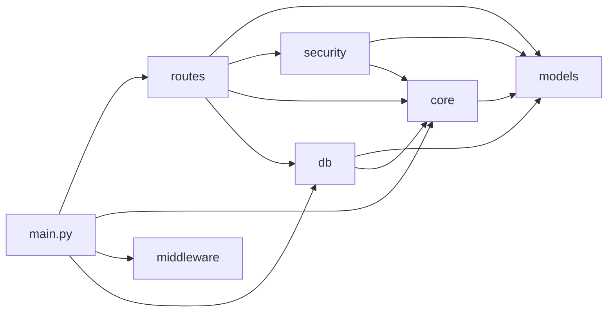

# TP1 — Definição do Domínio, EDA e API Base (Customer Support)

## Objetivo do projeto

Este repositório contém a primeira entrega (TP1) do Projeto de Bloco: um
sistema de atendimento ao cliente alimentado por inteligência artificial.
Nesta etapa o foco é **entender os dados** e **estruturar a API** que vai
servir o sistema ao longo do bloco.

Este TP entrega:
1. Documentação e **análise exploratória (EDA)** do
   [Customer Support Ticket Dataset](https://www.kaggle.com/datasets/suraj520/customer-support-ticket-dataset/data)
   (Kaggle), incluindo inspeção inicial, verificação de qualidade, limpeza,
   análise univariada e hipóteses sobre a intenção dos usuários.
2. A **estrutura base de uma API FastAPI** modular, com autenticação JWT
   (`OAuth2PasswordBearer`) protegendo o endpoint que futuramente servirá o
   modelo de classificação de intenção.
3. Um **DFD (Data Flow Diagram)** da API com entradas, saídas, trust
   boundaries e a tríade CIA (Confidencialidade / Integridade /
   Disponibilidade) aplicada a cada componente.

## Estrutura de pastas

```
.
├── README.md                 # este arquivo
├── pytest.ini                # configuração dos testes (rodar `pytest tests/` da raiz)
├── data/
│   └── customer_support_tickets.csv   # dataset bruto (Kaggle)
├── docs/                     # documentos de entrega (contrato do TP2, relatórios)
├── eda/
│   └── eda.ipynb             # notebook único com toda a EDA
├── tests/                    # testes automatizados da API
├── fastapi/                  # código-fonte da API
│   ├── main.py                # ponto de entrada: monta a aplicação FastAPI
│   ├── db.py                  # engine, sessão e criação das tabelas (SQLModel)
│   ├── requirements.txt
│   ├── core/                  # configuração e infraestrutura transversal
│   │   ├── config.py           # variáveis de ambiente, versão, chaves
│   │   ├── exception_handlers.py # respostas de erro padronizadas
│   │   └── limiter.py          # rate limiting do login
│   ├── routes/                # endpoints da API (camada HTTP)
│   │   ├── health.py           # GET /health
│   │   ├── auth.py             # POST /auth/token
│   │   ├── predict.py          # POST /predict (protegido por JWT)
│   │   └── tickets.py          # CRUD de tickets com verificação de ownership
│   ├── models/                # schemas Pydantic e tabelas SQLModel
│   │   ├── base.py             # StrictModel: base com extra="forbid"
│   │   ├── auth.py, predict.py, ticket.py   # entrada/saída das rotas
│   │   ├── health.py, errors.py             # respostas padronizadas
│   │   └── tables.py           # tabelas User e Ticket (SQLModel)
│   ├── middleware/            # headers de segurança HTTP e CORS
│   └── security/              # autenticação e JWT
│       ├── users.py            # usuário admin in-code (hash bcrypt)
│       └── jwt.py              # emissão/validação de token + OAuth2PasswordBearer
└── others/
    ├── dfd.py                 # script que gera o DFD (fonte versionada)
    └── dfd.png                # DFD da API com trust boundaries e tríade CIA
```

## Arquitetura da API

### Responsabilidade de cada módulo

| Módulo | Responsabilidade | O que **não** faz |
|---|---|---|
| `main.py` | Monta a aplicação: registra middlewares, handlers de erro e routers. É o único que conhece todos os outros módulos. | Não contém regra de negócio nem validação. |
| `routes/` | Camada HTTP: recebe a requisição, declara o schema de entrada e saída, chama as dependências de segurança e devolve a resposta. | Não define schemas (isso é `models/`) nem valida token na mão (isso é `security/`). |
| `models/` | Contrato de dados: schemas Pydantic de entrada/saída, respostas de erro e as tabelas SQLModel. É o módulo mais interno — não importa nenhum outro. | Não acessa banco, não lê requisição, não conhece rotas. |
| `security/` | Autenticação: hash e conferência de senha (`users.py`), emissão e validação do JWT e a dependência `OAuth2PasswordBearer` (`jwt.py`). | Não define rotas; expõe dependências que as rotas consomem. |
| `core/` | Infraestrutura transversal: configuração por variável de ambiente, handlers de erro e rate limiting. | Não conhece rotas específicas. |
| `middleware/` | Headers de segurança HTTP e CORS, aplicados a toda resposta. | Não autentica nem autoriza. |
| `db.py` | Engine do SQLModel, criação das tabelas e a dependência `get_session` (uma sessão por requisição). | Não contém queries de negócio — essas ficam nas rotas. |

### Dependências entre os módulos

O sentido das setas é "importa". Não há ciclos: a dependência sempre aponta da
camada mais externa (HTTP) para a mais interna (contrato de dados).



Em uma frase: **`routes` depende de `models` e de `security`; `security` depende
de `models`; `models` não depende de ninguém.** Por isso é possível testar os
schemas e a emissão de token sem subir a aplicação HTTP.

### Padrão das respostas

Toda rota declara `response_model`, inclusive `GET /health` (`HealthResponse`),
e toda resposta de erro — 401, 404, 422, 429, 500 — sai no mesmo formato
`ErrorResponse`, produzido pelos handlers em `core/exception_handlers.py`:

```json
{
  "code": "unauthorized",
  "message": "Não foi possível validar as credenciais",
  "path": "/predict",
  "fields": null
}
```

`code` é um identificador estável (é por ele que o cliente deve ramificar, não
pela mensagem) e `fields` só aparece em erros de validação (422), listando cada
campo rejeitado. Os formatos estão cobertos por testes em
[`tests/test_contrato_erros.py`](tests/test_contrato_erros.py).

## Dataset

- **Fonte:** [Customer Support Ticket Dataset](https://www.kaggle.com/datasets/suraj520/customer-support-ticket-dataset/data) (Kaggle, autor `suraj520`).
- **Características, motivo da escolha e EDA completa:** ver [`eda/eda.ipynb`](eda/eda.ipynb).
- O CSV usado nesta entrega está versionado em [`data/customer_support_tickets.csv`](data/customer_support_tickets.csv).

## Instalação

Pré-requisito: Python 3.11+ instalado.

```bash
# na raiz do repositório
python -m venv .venv

# Windows (PowerShell)
.venv\Scripts\Activate.ps1
# Windows (Git Bash) / Linux / macOS
source .venv/Scripts/activate   # ou: source .venv/bin/activate

# dependências da API
pip install -r fastapi/requirements.txt

# dependências extras para rodar o notebook de EDA (opcional)
pip install pandas numpy matplotlib seaborn jupyter nbclient ipykernel
```

## Execução

### API FastAPI

```bash
cd fastapi
uvicorn main:app --reload
```

A API sobe em `http://127.0.0.1:8000`. Documentação interativa
em `http://127.0.0.1:8000/docs`.

**Usuário único autorizado (definido in-code, ver [`security/users.py`](fastapi/security/users.py)):**

```
usuário: admin
senha:   admin123
```

Fluxo de teste manual:

```bash
# 1. Health check (rota pública)
curl http://127.0.0.1:8000/health

# 2. Login -> obtém o token JWT
curl -X POST http://127.0.0.1:8000/auth/token \
  -d "username=admin&password=admin123"

# 3. Chama a rota protegida com o token retornado acima
curl -X POST http://127.0.0.1:8000/predict \
  -H "Authorization: Bearer <TOKEN_AQUI>" \
  -H "Content-Type: application/json" \
  -d "{\"text\": \"I need a refund for my order\"}"
```

`POST /predict` ainda **não** roda um modelo de ML: ela retorna uma
intenção pré-determinada (baseada em correspondência simples de palavras-
chave) apenas para simular o formato de resposta que terá em um TP futuro.

### Notebook de EDA

```bash
# com o venv já ativado (ver seção Instalação)
cd eda
jupyter notebook eda.ipynb
```

## Segurança e DFD

O diagrama de fluxo de dados da API (entidades externas, processos, data
stores, trust boundaries e a tríade CIA aplicada a cada componente) está em
[`others/dfd.png`](others/dfd.png). Os 13 fluxos são numerados, e cada ponto em
que um dado atravessa uma trust boundary é marcado no diagrama com um losango
com o número do fluxo.

O diagrama é gerado por um script versionado — para alterá-lo, edite
[`others/dfd.py`](others/dfd.py) e regere o PNG:

```bash
python others/dfd.py
```

As correções aplicadas a partir do retorno do professor sobre o TP1 estão
documentadas em [`docs/CORRECOES_TP1.md`](docs/CORRECOES_TP1.md).

---

## TP2 — em andamento

Esta branch (`tp2/base`) contém as decisões de arquitetura e o esqueleto de
código a partir do qual o TP2 é desenvolvido. **Antes de começar, leia
[`docs/CONTRATO_TP2.md`](docs/CONTRATO_TP2.md)**: ele define a divisão de
tarefas, o modelo de dados, o contrato das rotas, os códigos de resposta e
quais arquivos não devem ser alterados sem combinar com o time.

Ambiente de desenvolvimento:

```bash
python3 -m venv .venv && source .venv/bin/activate
pip install -r fastapi/requirements-dev.txt   # API + pytest
pip install -r eda/requirements.txt           # apenas para o notebook de EDA
pytest tests/                                 # rodar da raiz do repositório
cd fastapi && uvicorn main:app --reload
```
